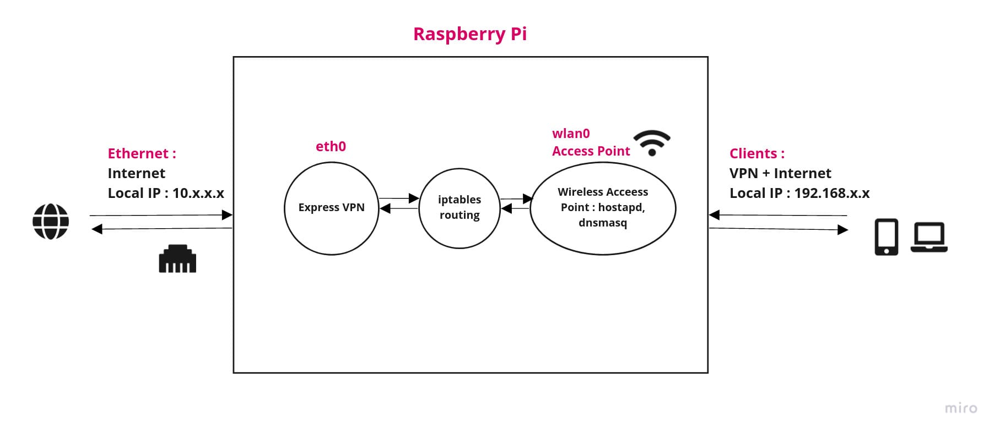

# Conclusion of this Project

- The speed of the Wifi from Raspberry Pi is being capped by the Wifi Adapter present in Raspberry Pi 4B.
- RPi 4B supports both 2.4 Ghz and 5Ghz but a band of only 20 Mhz. The speed is bein capped at 54 Mb/s (Mb - Megabits)
- The speed is capped mainly because the Wifi adapter shares the same bus as USB 2.0 ( according to some articles )

<p> Possible Solution : **Buy a USB 3.0 Wireless adapter which supports AP (Access Point) Mode.** </p>
<p> :warning: ` ** Its better to buy a router (300 Mbps) that can support OpenWRT Operating System as Pi is costly ** ` 
<p> So I am gonna most probably use my Pi for another projects now :D
# Acheieved Goals:

- Wifi connection at LBS:<br/> 

| Device | Before | After | After with Express Vpn |
| --- | --- | --- | --- |
| Android | 16 Mbps | 60 Mbps | Roughly Same: 54 Mbps |
| Laptop | 8 Mbps | 24 Mbps | Same: 20-24 Mbps |

- Able to run vpn on raspberry pi.
- Generally to connect two different devices with VPN we need to different account connections ( for express vpn key obtained for free through some resources ). This lead to exhaustion of key + the slow wifi made it unusable. But now multiple devices can connect to the Pi and use vpn with just one account registered with Pi and that too with *high* speed!

# Method:

The method is very trivial to understand, just the setup was a bit tough ( for me :D ) <br/>


# Tech Stack:

- hostapd : for AP creation (( check fast alternatives ))
- dnsmasq : for DNS/DHCP configuration of clients (( check for better and faster alternatives ))
- expressvpn : (( research in progress to find a better alternative [free, open source] ))

- Tutorial to set up AP in raspberry pi : [here](https://www.raspberrypi.com/documentation/computers/configuration.html#setting-up-a-routed-wireless-access-point)

# Configs:

## dhcpcd.conf

- Location : `/etc/dhcpcd.conf`

```
interface wlan0			
    static ip_address=192.168.4.1/24
    nohook wpa_supplicant

```

## routed-ap.conf

- Location : `/etc/sysctl.d/routed-ap.conf`

```
# Enable IPv4 routing
net.ipv4.ip_forward=1
```

## iptables config

- Command : `sudo iptables -t nat -A POSTROUTING -o eth0 -j MASQUERADE`
- Command 2 : `sudo iptables -t nat -A POSTROUTING -o tun0 -j MASQUERADE`
- `-o eth0` : the outgoing interface ( in this case LAN )
- `-o tun0` : required for VPN for tunnel interface forwarding


## dnsmasq config

- Location  : `/etc/dnsmasq.conf`

```
interface=wlan0 # Listening interface
dhcp-range=192.168.4.2,192.168.4.20,255.255.255.0,24h
                # Pool of IP addresses served via DHCP
domain=wlan     # Local wireless DNS domain
dhcp-option=6, 10.76.0.1
address=/gw.wlan/192.168.4.1
                # Alias for this router

```

## hostapd config

- Location : `/etc/hostapd/hostapd.conf`

```
country_code=IN
interface=wlan0
ssid=PiLan2
hw_mode=a
channel=36
macaddr_acl=0
auth_algs=1
ignore_broadcast_ssid=0
wpa=2
wpa_passphrase=SheharPi
wpa_key_mgmt=WPA-PSK
wpa_pairwise=TKIP
rsn_pairwise=CCMP
```

## interfaces config

- Location : `/etc/network/interfaces`

```
auto wlan0
allow-hotplug wlan0
iface wlan0 inet dhcp
wpa-conf /etc/wpa_supplicant/wpa_supplicant.conf
wireless-power off
iface default inet dhcp
```

- This is used to turn of the power management mode of inbuilt wifi

# Know Issues and Bugs:

- Express vpn does not work properly - a dns issue as it cant retrieve ip addresses given the hostname but it CAN ping directly to ip addresses -if force_vpn_dns is true (( insti network blocks custom dns - need more data to verify, maybe wrong )).<br/>
Workaround : <br/>
1. Expressvpn after connecting saves dns address in file at `/etc/resolv.conf.bak` or similar ( can be verified by viewing the file ).
2. Just copy that dns address and paste it in the file `/etc/resolv.conf`.
3. To let connected clients connect to internet on vpn edit the file `/etc/dnsmasq.conf` and edit the line `server=<EXPRESSVPN IP HERE>` and then reload the dns service using `sudo systemctl restart dnsmasq.service`.<br/>

- Speed is slower : LAN 300 Mbps -> VPN 70 Mbps on Pi -> 60 Mbps Android (( MAYBE DUE TO BOTTLENECK ON PI and LESS BANDWIDTH OF INBUILT WIFI ADAPTER## To be verified with Pi fan and usb wifi 300Mbps ))

- Redirection issues while opening some nsfw websites (xnxx,xvideos) and torrent sites (1337x.to, rarbg.to) but pornhub, whatsapp, telegram, slack, discord, steam and online games work.
