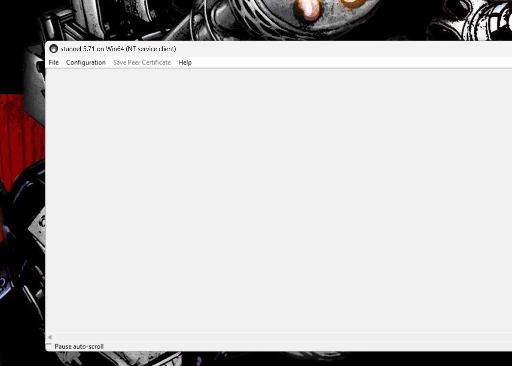
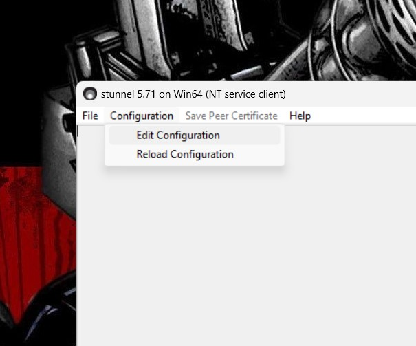
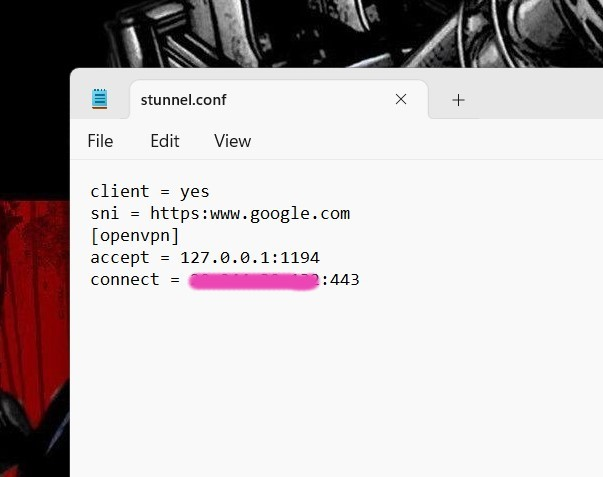
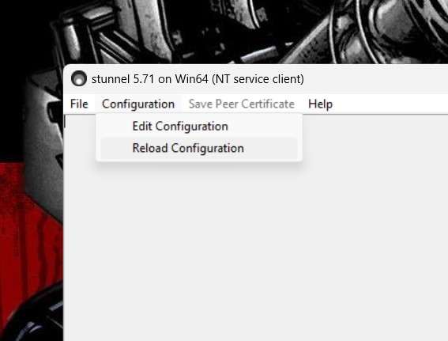

# Index

* 1\. [VPNs](#1-vpns)
    * 1.1 [Using OpenVPN (Updated)](#11-using-openvpn)
* 2\. [LAN](#2-lan)
* 3\. [WIFI](#3-wifi)


# 1. VPNs
 
**Working VPNs**

- [HotspotShield](https://www.hotspotshield.com/)
- [Speedify](https://speedify.com/) (Not free)
- [ExpressVPN](https://www.expressvpn.com/) (Not free)
- [OpenVPN](https://openvpn.net/) hosted on [DigitalOcean](https://www.digitalocean.com/) or [AWS ec2](https://aws.amazon.com/ec2/)
- [TLS Tunnel](https://play.google.com/store/apps/details?id=com.tlsvpn.tlstunnel) (free user)
- [SecureVPN](https://play.google.com/store/apps/details?id=com.fast.free.unblock.secure.vpn&hl=en_IN&gl=US) (free user)
- [NoCardVPN](https://play.google.com/store/search?q=no%20cardvpn&c=apps&hl=en_IN&gl=US)
- [Psiphon](https://play.google.com/store/search?q=psiphon&c=apps&hl=en_IN&gl=US)
- [SetupVPN](https://chrome.google.com/webstore/detail/setupvpn-lifetime-free-vp/oofgbpoabipfcfjapgnbbjjaenockbdp)
- [HoxxVPN](https://chrome.google.com/webstore/detail/hoxx-vpn-proxy/nbcojefnccbanplpoffopkoepjmhgdgh)

**TCP** based VPNs that work on port `443` or `80` will only work.

## 1.1 Using OpenVPN

> There has been firewall changes, and the steps are updated accordingly in Step 3. Step 1 and step 2 remain the same.

### Step 1: Get an AWS account

> ⚠️ Make sure to setup the server properly at your own risk. I am not liable to any charges you receive for your mistakes. First watch video about Billing here - [Billing and Terminating Instances](https://www.youtube.com/watch?v=Ptij0mq1Mv4).

Watch this video on how to create a free AWS account - [Create new AWS account](https://www.youtube.com/watch?v=gA9pl-A9gDM). Remember this step requires you to have a debit card (Mastercard, American Express or Visa).


### Step 2: Create a free ec2 instance

Watch this video on how to create an ec2 instance- [Creating an AWS EC2 instance](https://www.youtube.com/watch?v=bJUBSqWaPBQ).


### Step 3: Setting Up OpenVPN Access Server (Updated):

>⚠️  This is only for people that want to use VPN for their internship works. I am not liable to any actions against you for illegal use of this documentation.


You will need mobile hotspot for this setup.
To setup OpenVPN Access Server, watch this video (old).  - [Steps to create OpenVPN Server on AWS](https://www.youtube.com/watch?v=7vxWiIRWwF4).

__Updated Steps__

This is for Linux/Windows, for Android/IOS , it's better you figure it out. That also has similar steps 

###### Server Side

- SSH into your server (as shown in the video) and follow along the video with these new steps.
  
For first time users, before running the openvpn script, do the following :
- Instead of the script mentioned in the video, use the following commands  and proceed as you would (like in the video) using `sudo ./openvpn-install.sh` :  
  ```shell
    curl -O https://raw.githubusercontent.com/sheharyaar/iit-kgp-network/feat-next-update/openvpn-install.sh
    chmod +x openvpn-install.sh
    sudo ./openvpn-install.sh
    ```
- Download the ovpn files as shown in the video. next see Client side (below)

For people who __already have OpenVPN hosted__ on server:
- SSH into the server and run the script which you had installed earlier by running `sudo ./openvpn-install.sh`
- Use the option `Remove OpenVPN and enter y to uninstall it`
- Remove the script using `rm openvpn-install.sh`
- Download the new script given in previous step and proceed with natural installation steps and then download the ovpn files using winscp/scp as you did earlier.

###### Client Side (Windows / Linux)

After completing the steps on the server side, on the `Windows`` side do the following : 
- Install stunnel from its official website ([here](https://www.stunnel.org/downloads.html)). Linux popele search in their distributions repository (apt/aur) for the package.
- Open stunnel and use the following config (dont forget to replace `123.45.6` with your IP):
    ```conf
    client = yes
    sni = https:www.google.com
    [openvpn]
    accept = 127.0.0.1:1194
    connect = 123.45.6:443
    ```

    Apply the config here : 
    - Step 1 : In the action tool bal find the stunnel icon and double click, a window will open
    
    - Step 2 : In the window Goto Configuration > Edit Configuration
    
    - Step 3 : Paste config above as shown, press Ctrl+S to save and close the notepad
    
    - Step 4 : Goto Configuration > Reload Configuration, you should see configration successful
    

- Run openvpn now and iport the ovpn config as earlier

###### For technical people
> Please use TCP_NODELAY option if you use this vpn for gaming. Else skip

- SSH into your vpn server
- execute `sudo echo "tcp-nodelay" | sudo tee -a /etc/openvpn/server.conf`
- restart openvpn service using `sudo systemctl restart openvpn.service && sudo systemctl restart openvpn@server.service`

### Step 4: Bill Management

This is a very important setup, to avoid any extra charges from your debit card. Watch this video - [Billing and Terminating Instances](https://www.youtube.com/watch?v=Ptij0mq1Mv4). <br/>
Remember to use only one instance. <br/>
Remember that bandwidth is _**free upto 100GB per month**_, so its better not to waste resource on the vpn. Use it for daily usages like whatsapp, discord, etc. Prevent torrenting, etc. which can eat up resources.<br/>
Remember to check your usage weekly/biweekly as shown in the video.<br/><br/>
If in any case you have to stop an instance forcibly, do it to be on the safe side.

# 2. LAN 

### 2.1 LAN Cable : 

Make sure your cable is CAT 5e and better (6, 6e, etc.) that you can get easily in TechM. 

### 2.2 Ethernet Adapter properties :

Check if your system supports 1 Gbps connection. Check online tutorials for your operating system for that.


# 3. WIFI 

To use Wifi on your devices :
- Select Authentication type : `MSCHAPv2`
- CA Certificate : `Do not validate`
- Identity : `Your Roll number`
- Password : `Password set in ERP`
- Anonymous Identity : Keep Blank

:warning: On some latest version of Android 11, the interface does not have option to disable Certificate Validation. Please use your laptop as Wifi-Hostpot.

**Setting up router at your room :**

Buy a good 300Mbps or (1 Gbps if u are rich) and then use ethernet interface to distribute internet wia the wifi interface.<br><br>
- Reset the router if its not new
- Go to setup after connecting to the internet
- When asked for Connection type, select any of the following available : `bridge`, `ethernet bridge`.
- Then setup your wifi properties
- If asked for DNS settings, select `automatic`, otherwise use the DNS address as : `127.0.0.53`

