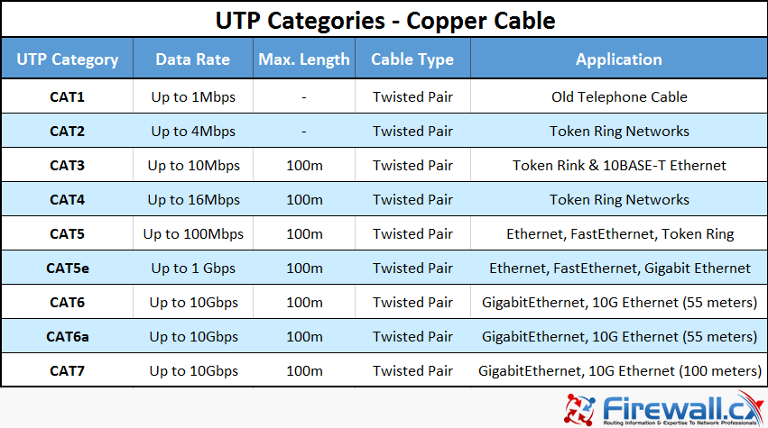
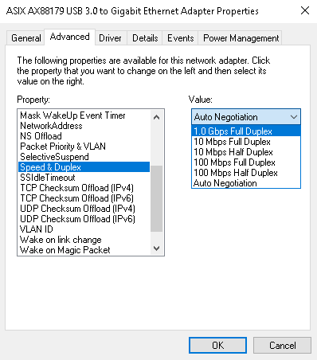
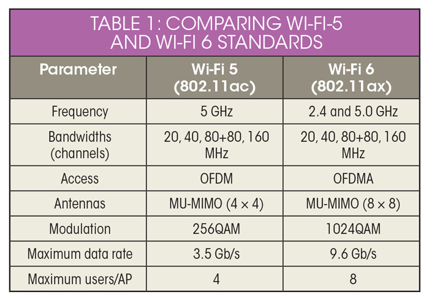

# Index

* 0\. [Introduction](#0-introduction)
* 1\. [VPNs](#1-vpns)
    * 1.1 [Using OpenVPN](#11-using-openvpn)
    * 1.2 [Observation : ExpressVPN and Speedify work best](#12-observation--expressvpn-and-speedify-work-best)
* 2\. [Slow LAN Speed](#2-slow-lan-speed)
* 3\. [Slow WIFI Speed](#3-slow-wifi-speed)
    * 3.1 [Best Solution](#31-best-solution)
    * 3.2 [Other Solutions](#32-other-solutions)
* 4\. [Discussion](#4-discussion)
    * 4.1 [Packet Filtering](#41-packet-filtering)
    * 4.2 [VPN Protocols](#42-vpn-protocols)
    * 4.3 [Wireguard](#43-wireguard)
    * 4.4 [OpenVPN vs ExpressVPN vs Speedify](#44-openvpn-vs-expressvpn-vs-speedify)
    * 4.5 [Further Steps](#45-further-steps)
* 5\. [Contributing](#5-contributing)
* 6\. [Credits](#6-credits)


# 0. Introduction


In this repo, I will write about the problems students face on campus network and attempt to provide solution (feasible or non feasible). The solutions end at Section 3.

In Section 4, I will write in depth discussion on why do few protocols, which are really good, like Wireguard, UDP based VPNs, etc. do not work on campus network. Feel free to skip that section if you are not interested.

Section 5 deals with Contributing rules and Section 6 ends with a vote of thanks to people who helped me in anyway.

> I am working on a VPN implementation based on lightway by ExpressVPN - [check out](https://github.com/sheharyaar/lagnos-vpn)


# 1. VPNs
 
- **Recommended Solutions**


|VPN|Platform|Status| Reason |
|---|---|---| --- |
| [Speedify](https://speedify.com/) (Not free &#183; 2gb/mo free-trial) | ![w] ![l] ![a] ![m] | ✔️ | It's the best -- after ExpressVPN removing its servers from India; with a latency of around 40ms(tested 4 times; exhausting its free-user plan) and a speed of 450 Mbps on an average (source: Ookla; where it was around 700+ Mbps earlier) which makes it suitable for gaming and every other purpose; and its early plan is similar to that of ExpressVPN but here comes the twist, Speedify comes with 3-years plan option saving you 4.8k INR in 3 years(as compared to ExpressVPN)! |
| [ExpressVPN](https://www.expressvpn.com/) (Not free) | ![w] ![l] ![a] ![m] | ✔️ | Even though paid, it's fast, stable and the secure option out in the internet but with [Update in Indian laws to store logs for servers in India](https://www.techradar.com/news/any-vpn-with-servers-in-india-must-now-store-activity-logs-on-users), ExpressVPN has removed its servers and the latency has been increased upto 120ms thus making it unsuitable for gaming. |
| [OpenVPN](https://openvpn.net/) hosted on [DigitalOcean](https://www.digitalocean.com/) or [AWS ec2](https://aws.amazon.com/ec2/) | ![w] ![l] ![a] ![m] | ✔️ | This is slower than ExpressVPN but it's very much feasible for using on PC/Laptop.<br/> It uses more CPU than ExpressVPN and Wireguard |
| [Mullvad](https://mullvad.net/en/) |  ![w] ![l] ![a] ![m] | ✔️ | It's paid (5€), But it works very well and securely in OpenVPN mode with TCP port 443 and bridging mode. Note that Mullvad has no servers in India, so gaming is basically impossible since the ping will be too high and Anticheat may prevent you. |
| [SecureVPN](https://play.google.com/store/apps/details?id=com.fast.free.unblock.secure.vpn&hl=en_IN&gl=US) |  ![a] | ✔️ | Use its free plan. The free plan will suffice the use case on mobile devices; Select the free server with ads and voila you will be connected and no need to upgrade your time as in NoCardVPN; you will be shown ads only when you open the app, so connect it and never open it again. Speed will be highly reduced but suffice for WhatsApp and normal video streaming. |
| [NoCardVPN](https://play.google.com/store/search?q=no%20cardvpn&c=apps&hl=en_IN&gl=US) |  ![a] | ✔️ | Works like a charm with no significant loss in speed, but have to manually increase connection time (10/20/30/40/60 mins depending on your luck; else it will disconnect after that time is over) during which they serve ads for the survival of the project since it is completely free on user's end. |

ℹ️ For detailed comparison of OpenVPN on EC2, DigitalOcean, ExpressVPN and Speedify for `gamers` and `casual users`, see [OpenVPN vs ExpressVPN vs Speedify](#44-openvpn-vs-expressvpn-vs-speedify) section. 

- Working Solutions but **not recommended**:

|VPN|Platform|Status| Reason |
|---|---|---| --- |
| [Psiphon](https://play.google.com/store/search?q=psiphon&c=apps&hl=en_IN&gl=US) | ![a] | ✅ | Uses `L2TP/IPsec`. For more info on protocols see [VPN Protocols](#42-vpn-protocols) section.<br/>Slow and requires more CPU consumption. |
| [SetupVPN](https://chrome.google.com/webstore/detail/setupvpn-lifetime-free-vp/oofgbpoabipfcfjapgnbbjjaenockbdp) | ![w] ![l] ![m] | ⚠️ | No information on which protocols are used.<br/>Maybe unsafe.<br/>Full services for paid users.
| [HoxxVPN](https://chrome.google.com/webstore/detail/hoxx-vpn-proxy/nbcojefnccbanplpoffopkoepjmhgdgh) | ![w] ![l] ![m] | ⚠️ | It's not a VPN, its more like a proxy for PC. For browsers, it uses `http tunneling`.<br/>It's unsafe as; it uses 4096-RSA, which has already been cracked.

- Not working or untested:

|VPN|Platform|Status| Reason |
|---|---|---| --- |
| [Wireguard](https://www.wireguard.com/) hosted on any server | ![w] ![l] ![a] ![m] | ❌ | Uses UDP, which is blocked. More about this under [Wireguard](#43-wireguard) section |
| [Warp (1.1.1.1)](https://1.1.1.1/) | ![w] ![l] ![a] ![m] | ❌ | Uses Wireguard internally |
| [Surfshark](https://surfshark.com/) | ![w] ![l] ![a] ![m] | ❌ | Uses Wireguard internally. Main hope was it's network masking, but apparently that failed too; the vpn was able to connect to only one location out of 67 tested locations with one specific port only (UK port 80), that too with a speed of 6mbps(OOKLA). |
| [VPNHub](https://play.google.com/store/apps/details?id=com.appatomic.vpnhub&hl=en_IN&gl=US) |  ![a] | ❌ | Could have worked by changing the settings, but that is for paid users only. |
| [Tor](https://www.torproject.org/) | ![w] ![l] ![a] ![m] | ❌ | Tor commonly uses ports 9001 and 9030 for network traffic and directory information - [source](https://wiki.wireshark.org/Tor#protocol-dependencies), which are blocked on network. See more about blocked ports under [Packet Filtering](#41-packet-filtering). |
| [NordVpn](https://nordvpn.com/) | ![w] ![a] ![l] ![m] | ❔ | Uses NordLymx (based on Wireguard) by default, it can work as it also supports OpenVPN. But it's paid |
| [HotspotShield](https://www.hotspotshield.com/) | ![w] ![l] ![a] ![m] | ❔ | Not yet tested, it's paid |

❔ : Untested


#### Conclusion:

- **UDP** based VPNs don't work because UDP is dropped (see [Packet Filtering](#41-packet-filtering)) unless some tunneling is used.
- **TCP** based VPNs work on port `443` as it is allowed. Connection on other ports are reset ( see - issue[#2](https://github.com/sheharyaar/vpn/issues/2) ).<br> 
- **OpenVPN, ExpressVPN and Speedify** are the fastest **and** the most secure VPNs available.


## 1.1 Using OpenVPN

### Step 1: Get an AWS account

> ⚠️ Make sure to setup the server properly at your own risk. I am not liable to any charges you receive for your mistakes. First watch video about Billing here - [Billing and Terminating Instances](https://www.youtube.com/watch?v=Ptij0mq1Mv4).

Watch this video on how to create a free AWS account - [Create new AWS account](https://www.youtube.com/watch?v=gA9pl-A9gDM). Remember this step requires you to have a debit card (Mastercard, American Express or Visa).


### Step 2: Create a free ec2 instance

Watch this video on how to create an ec2 instance- [Creating an AWS EC2 instance](https://www.youtube.com/watch?v=bJUBSqWaPBQ).

> The further 2 steps are derived from a blog, [IIT KGP: Bypassing network restrictions without compromising on internet speed by Anjay Goel](https://anjaygoel.github.io/posts/IIT-KGP-Bypass-Internet-Restrictions/#step-3-setting-up-openvpn-access-server) 

### Step 3: Setting Up OpenVPN Access Server:

You will need mobile hotspot for this setup.
To setup OpenVPN Access Server, watch this video - [Steps to create OpenVPN Server on AWS](https://www.youtube.com/watch?v=7vxWiIRWwF4).

### Step 4: Download ovpn files

*   **Linux/MacOS**: Run the command - `scp -i /path/to/privatekey <username>@<host>:/path/to/ovpn_file ~/Documents/`, the key will be downloaded in Documents.
    
*   **Windows**: Skip this section.

*   **Android**: See the windows/linux/MacOS step and then transfer the downloaded android.ovpn to phone via Telegram/Bluetooth/Mail or whatever to a folder in your android.

### Step 5: Connecting to VPN on client devices:

*   **Android**: Download [Open VPN Connect](https://play.google.com/store/apps/details?id=net.openvpn.openvpn&hl=en_IN&gl=US) app from Play Store. Open the app and after going throught the first screen, got to **Files** tab of the app, import the ovpn file and connect.
    
*   **Linux**: In many distros, you can go to the network manager and import the ovpn file. If not then install OpenVPN (`$ sudo apt-get install openvpn`) and run using `$ sudo openvpn --config /path/to/config.ovpn`.

*   **MacOS**: You can either download the [tunnelblick](https://tunnelblick.net/downloads.html) GUI tool for importing the ovpn files or download the cli tool for openvpn via MacPorts or brew using `$ sudo ports install openvpn` and `$ brew install openvpn` respectively; then execute `$ sudo openvpn --config /path/to/config.ovpn`.
    
*   **Windows**: Download the [official client](https://openvpn.net/client-connect-vpn-for-windows/), import the ovpn file and run - watch video here - [Steps to connect to OpenVPN](https://www.youtube.com/watch?v=P2SroQ_pzPU)

### Step 6: Bill Management

This is a very important setup, to avoid any extra charges from your debit card. Watch this video - [Billing and Terminating Instances](https://www.youtube.com/watch?v=Ptij0mq1Mv4). <br/>
Remember to use only one instance. <br/>
Remember that bandwidth is _**free upto 100GB per month**_, so its better not to waste resource on the VPN. Use it for daily usages like whatsapp, discord, etc. Prevent torrenting, etc. which can eat up resources.<br/>
Remember to check your usage weekly/biweekly as shown in the video.<br/><br/>
If in any case you have to stop an instance forcibly, do it; to be on the safe side.

## 1.2 Observation : ExpressVPN and Speedify work best


Express VPN works and it works damn fast - it uses `Lightway Protocol` whose core is open sourced now [here](https://github.com/expressvpn/lightway-core) - and a combination of `iptable` rules and `DNS Resolution`.<br/>
My speculation is that it runs in TCP Mode and it's fast. But I need to verify this by looking at logs and iptable entries. I speculate that `Lightway UDP` doesn't work because I tried it specifically on the Android version of the app, it didn't connect at all where the TCP counterpart connected quickly.


Speedify improves the performance of even a single internet connection when faced with latency or packet loss. It intelligently makes up to 8 simultaneous TCP connections back to Speedify Servers on each of our internet connections allowing it to send and receive data redundantly or in parallel as needed.<br/>
With the feature of utilising multiple interfaces(Wifi+Ethernet) together it can boost the speed to a considerable amount.

> I will try to implement soon my own lightway based VPN. So do checkout this page in future too!


# 2. Slow LAN Speed

Before concluding that there is issue with the port, make sure to check the following

### 2.1 LAN Cable : 

Make sure your cable is CAT 5e and better (6, 6e, etc.) that you can get easily in TechM. 




### 2.2 Ethernet Adapter properties :

It's easy to check properties of your ethernet adapter.<br/>

#### For linux users

```console
$ ip link list
1: lo: <LOOPBACK,UP,LOWER_UP> mtu 65536 qdisc noqueue state UNKNOWN mode DEFAULT group default qlen 1000
    link/loopback 00:00:00:00:00:00 brd 00:00:00:00:00:00
2: eno2: <BROADCAST,MULTICAST,UP,LOWER_UP> mtu 1500 qdisc fq_codel state UP mode DEFAULT group default qlen 1000
    link/ether 24:4b:fe:6f:4f:b4 brd ff:ff:ff:ff:ff:ff
    altname enp3s0
3: wlo1: <NO-CARRIER,BROADCAST,MULTICAST,UP> mtu 1500 qdisc noqueue state DOWN mode DORMANT group default qlen 1000
    link/ether 3c:58:c2:da:d9:69 brd ff:ff:ff:ff:ff:ff
    altname wlp0s20f3
...
more info
```

In this case `eno2` is my ethernet adapter. So next use `ethtool`, if not present google how to install (for unix/linux only).

```console
$ ethtool eno2
Settings for eno2:
	Supported ports: [ TP	 MII ]
	Supported link modes:   10baseT/Half 10baseT/Full
	                        100baseT/Half 100baseT/Full
	                        1000baseT/Full
                           
...
more info 
```

As you can see it shows `1000baseT/Full`. This means my adapter supports 1000 Mbps ( 1Gbps ) with Full Duplex.

#### For windows users: [Check this post](https://www.windowscentral.com/how-determine-wi-fi-and-ethernet-connection-speed-windows-10)

ℹ️ If your speed is less than 1Gbps, check about your laptop manually online. If it shows it supports 1Gbps, update your drivers.

### 2.3 Disbale auto-negotiation


✔️ This is really important section. 

Sometimes even though everything is correct the speed gets capped around `75Mbps`. This is due to the LAN server auto negotiates to a speed which can be used by both the parties (server and client). You can force the speed and duplex to full speed.

⚠️ This may not work for everybody so your connection **will go out** for a moment but it will come back soon. If it doesn't connect at all (at present or in future cases) then revert the changes to auto.

This method worked for me (tested on linux) and after a system restart my speed shot up from `75mbps` to direcrtly `700-800Mbps`. I used ethtool again for this.
```console
$ sudo ethtool -s [device_name] speed [10/100/1000] duplex [half/full] autoneg [on/off]
```
Here device_name is obtained from `ip link list` (the same from previous step). Speed is in Mbps - 1000 means 1Gbps, and duplex is the communication multiplexing - full means both ways. autoneg will be off.

In my case (since the institute network supports 1Gbps we can use full duplex, it's less probable that it will cause issues like more collisions - [see here](https://en.wikipedia.org/wiki/Duplex_mismatch). The insti server auto negotiates and we won't so maybe a mismatch. ) I used this command :

```console
$ sudo ethtool -s eno2 speed 1000 duplex full autoneg off
```

To revert back:
```console
$ sudo ethtool -s eno2 speed 1000 duplex full autoneg on
```

#### For Windows users : [Follow this guide](https://docs.microsoft.com/en-us/azure/devops/reference/xml/configure-network-adapter-automatically-adjust-speed?view=tfs-2013). **But**, in the last step instead of `Auto`, select `1.0 Gbps Full Duplex`.



> Note: If still the network is slow, then it must be the issue with the port or the entire network is slow due to maintainence.

# 3. Slow WIFI Speed

The institute has a fast Ethernet connection but a notoriously slow Wifi (95% of the cases) due to its usage of `2.4 ghz` and `20MHz` bandwidth with a Bit-rate of `72.2Mb/s` (Megabits/s). This wifi is shared with many people in the same wing which brings its speed down to 10-12 Mbps.


```console
lagnos@rog:~$ iwconfig wlo1
wlo1      IEEE 802.11  ESSID:"STUDENT_SECURED"
          Mode:Managed  Frequency:2.412 GHz  Access Point: E8:BA:70:61:38:E2
          Bit Rate=72.2 Mb/s   Tx-Power=20 dBm
          Retry short limit:7   RTS thr:off   Fragment thr:off
          Power Management:on
          Link Quality=50/70  Signal level=-60 dBm
          Rx invalid nwid:0  Rx invalid crypt:0  Rx invalid frag:0
          Tx excessive retries:2004  Invalid misc:5420   Missed beacon:0
```

ℹ️ The below solutions will work only if your LAN is working at a good speed.

## 3.1 Best Solution


The current laptops either use Wifi 5 or Wifi 6. The can be summarised as follows : 




Source : [What’s the Difference Between Wi-Fi 5 and Wi-Fi 6?](https://www.mwrf.com/technologies/systems/article/21849959/whats-the-difference-between-wifi-5-and-wifi-6)

<br/>
<br/>

As you can see Wifi 5 supports `802.11ac` and Wifi 6 supports even better protocol, they are much capable of handling 1 Gbps.<br/>
So the best solution will be to `create Wifi hotspot in your laptop and use it in android`.<br/>
The speed of the network will depend on your connected devices. In new phones (2020 and above) you can get speed around `200 Mbps (20x)` easily.

For ExpressVPN users : just connect your android on the hotspot created in windows and use the VPN **on your phone**. It works and gives `150 Mbps (15x)` easily.


## 3.2 Other Solutions

**Just buy a router/repeater or use raspberry Pi**

**Setting up router :**

Buy a good 300Mbps or (1 Gbps if u are rich) and then use ethernet interface to distribute internet wia the wifi interface.<br/>
Before buying check if it will support OpenWRT, to be able to forward conenctions from ethernet to wifi ( to be used as Access point ) and vice versa.
Setting up can be a bit tedious for beginner but it will give high speed internet.

> Benefits : You can get 300Mbps internet, and even if u share with 3 room mates u still get arorund 100 Mbps in the worst case scenario which is much better than getting 12-13 Mbps on Wifi

**For Raspberry Pi :**

- The logic is same, route the connections on Wifi interface via the ethernet interface.
- Buy a 150/300 Mbps usb adapter which is **capable of AP mode** (verify before buying).

For detailed config : Check out my post [here](./rpi-express.md).

> Benefits : As in the previous solution you can get much better speed than the institute wifi and can enjoy online streaming. Cheers!


# 4. Discussion


This section is a read for people who wish to know why various protocols like Wireguard or OpenVPN (UDP) did not work. Anything that is written here are my observations and may not be absolutely correct. If you find any error please open an issue and inform me about it to make this repository more accurate. This is going to be a long read, so buckle up 🚀.

- There is packet filtering as the network prohibits the use of ceritifcates for the connection and uses `PEAP + MSChapv2` ( which btw is very much vulnerable).  Credentials can be cracked easily and MITM (Man in the middle attacks) can be used against a conenction. So it's better to implement some security methods. For more info lookup : `chapcrack` on Google.


## 4.1 Packet Filtering

| Protocol | Status | Proof | Remarks |
| ---  | --- | --- | --- |
| UDP  | 🟠 | <ul><li>The network connected well to server hosted on Cloud on non standard port `55555` over UDP. But the connection is dropped after just a few requests (<a href="https://github.com/sheharyaar/iit-kgp-network/issues/2">see issue</a>)</li></ul>  | <ul><li> UDP works and connects to an external server on any unused port, other than the standard ports.</li><li> As common ports are most probably blocked, services like `DNS` doesn't work. Hence programs depending on DNS-name resolution like `dig` and `nslookup` won't work. The server is able to use **only the DNS provided by campus network DHCP** </li><li>To make DNS work we need `iptables` magic on Linux. This `iptables` is used by expressvpn to forward DNS requests. Read More in Discussions.</li></ul> |        
| TCP  | 🟠 | <ul><li>Server hosted on cloud could be connected via `netcat` and `telnet` without issues on port `55555` and similar private ports.But the connection is dropped after just a few requests (<a href="https://github.com/sheharyaar/iit-kgp-network/issues/2">see issue</a>)</li></ul>|<ul><li>TCP Based VPNs do work even though very much slow</li><li>Servers outside the campus network can be accessed over TCP comfortably, on any unused port other than the common ports.</li><li>`tor` cannot be used (TCP over LTS) as it cannot connect to the nodes.</li><li> Need to check tor on a private port and update info.</ul>|
| ICMP | ❌ | <ul><li>`ping` and `traceroute` doesn't work at all</li></ul> | <ul><li>ICMP packets are plainly dropped displaying normal firewall behaviour.</li></ul> |

## 4.2 VPN Protocols
<!-- Different type of protocols -->

|Rank||Speed|Stability|Security|Encryption|
|---|--- |--- |--- |--- |--- |
|1|Speedify|Very Fast|Very Stable|Very High|AES128-GCM|
|2|ExpressVPN|Very Fast|Very Stable|High|WolfSSL|
|3|WireGuard|Fast|Stable|High|ChaCha20|
|4|OpenVPN|Fast|Very stable|Very high|160-bit, 256-bit|
|5|IKEv2/IPSec|Fast|Very stable|High|256-bit|
|6|L2TP/IPsec|Medium, due to double encapsulation|Stable|Medium|256-bit|
|7|SSTP|Fast|Very stable|High|256-bit|
|8|PPTP|Speedy, due to low encryption|Very stable|Weak|128-bit|

Resources Used :

[Comparing WireGuard and Lightway](https://www.expressvpn.com/blog/comparing-wireguard-and-lightway-3-reasons-we-created-lightway/)<br/>
[OpenVPN vs IPSec, WireGuard, L2TP, and IKEv2](https://restoreprivacy.com/vpn/openvpn-ipsec-wireguard-l2tp-ikev2-protocols/)<br/>
[Best VPN Protocols: OpenVPN vs PPTP vs L2TP vs Others](https://thebestvpn.com/pptp-l2tp-openvpn-sstp-ikev2-protocols/)<br/>
[Wireguard](https://www.wireguard.com/#about-the-project)<br/>
[Lightway vs Wireguard vs OpenVPN - Youtube](https://www.youtube.com/watch?v=28e1sDvrkrk)<br/>
[What kind of Encryption does Speedify use?](https://support.speedify.com/article/274-encryption#:~:text=For%20any%20recent%20phone%20or,cipher%20to%20protect%20your%20data.)

And many more...

## 4.3 Wireguard
<!-- Problem with using wireguard and alternatives and their problems -->

As we see in the section above, Wireguard is faster than OpenVPN. So it was a very good choice for a VPN. 

- The issue faced in setting up was that Wireguard is `UDP only` VPN whereas the only option for us is to route traffic through `TCP:443`.
- Tunneling TCP over TCP can be a disaster : [Why TCP Over TCP Is A Bad Idea](http://sites.inka.de/bigred/devel/tcp-tcp.html)
- There are alternative solutions which involve `tunneling UDP over TCP` using utilities like : [udp2raw](https://github.com/wangyu-/udp2raw) and [udptunnel](http://www1.cs.columbia.edu/~lennox/udptunnel/). But sadly I was unable to set them up and couldn't make them work.
- Even routing UDP over TCP is not much of a good idea and did not produce interesting results. The above method results in a performance similar to OpenVPN so why not just use OpenVPN : [Using Wireguard when UDP is blocked](https://blog.rraghur.in/2018/11/24/using-wireguard-when-udp-is-blocked/). The other issue of routing UDP over TCP is it is diffcult to this on every platform, like android requires root privileges for this.

Resources Used:

[Known Limitations](https://www.wireguard.com/known-limitations/)<br/>
[https://gist.github.com/insdavm/90cbeffe76ba4a51251d83af604adf94](https://gist.github.com/insdavm/90cbeffe76ba4a51251d83af604adf94)<br/>
[https://github.com/wangyu-/udp2raw/issues/411](https://github.com/wangyu-/udp2raw/issues/411)<br/>
[https://encomhat.com/2021/07/wireguard-over-tcp/](https://encomhat.com/2021/07/wireguard-over-tcp/)


## 4.4 OpenVPN vs ExpressVPN vs Speedify
<!-- Complete comparison of speed in games and casual too -->
The testing was done on a couple of devices from the campus ( LBS and JCB Hall ). Devices being - ROG Strix G15 2020, Aspitre 7 and MSI GL65 Leopard.

⚠️**NOTE**: The following data for ExpressVPN is not updated after the removal of its servers from India due to [update in Indian laws to store logs for servers in India](https://www.techradar.com/news/any-vpn-with-servers-in-india-must-now-store-activity-logs-on-users); stay tuned will be updated soon.


- For casual users 💻

| Server | Download Speed Before | Download Speed After |
| --- | --- | --- |
| ⚠️ ExpressVPN | 600 Mbps | 500-550 Mbps |
| Speedify | <750 Mbps | 450-500 Mbps |
| OpenVPN - AWS ec2 | 600 Mbps | 150 Mbps |
| openVPN - Digital Ocean | 600 Mbps | 200 Mbps |
| Mullvad (OpenVPN) - Singapore | 100 Mbps | 50 Mbps |

- For gamers 😎

CSGO Official Servers:
| Server | Ping | Packet Loss | Remarks |
| --- | --- |--- | --- |
| ⚠️ ExpressVPN - Mumbai | 50-70 ms | Rare | It's Paid T_T | 
| OpenVPN - AWS ec2 | 60-80 ms| Rare | It's free for 1 year with 1 account. <br/> 4 people 4 years. Ez Katka 😄 |
| OpenVPN - DigitalOcean | 130+ ms | 2-4 % | Don't use it, not worthy |

Valorant
| Server | Ping | Packet Loss | Remarks
| --- | --- |--- | --- |
| ⚠️ ExpressVPN - Mumbai | 50-80 ms | Rare | ✔️ 
| OpenVPN - AWS ec2 | 70-90 | Rare | ✔️ 💙
| OpenVPN - DigitalOcean | 120+ ms | 5-6 % | 😞 |

> Need testers for testing gaming on Speedify.


As you could see, ExpressVPN maybe the best. Among AWS and DigitalOcean, `AWS` is much better as its servers are in Mumbai whereas for DigitalOcean, they are in Bangalore.

## 4.5 Further Steps

This repository is available for anyone who wishes to add upon this work or needs information for any purpose or maybe is planning to implement their own VPN. For me, I would love to research more on this topic and look for ways to improve the Internet situation at the campus. It was really difficult with bad network at the campus to be able to even talk with parents on video call as whatsapp and similar apps are blocked.

Beleiving in open source I hope someone will add value to this repository, so that even people with less technical experience can understand basic comparisons among the various servers and technologies.

# 5. Contributing

I appreciate feedback, correction and contribution to this repository! Before you get started, please see [CONTRIBUTING](./CONTRIBUTING.md)

# 6. Credits

A great vote of thanks to the following contributors :
- Ishan Manchanda ([@IshanManchanda](https://github.com/IshanManchanda)) - Contribution to the list of working VPNs.
- Soham Sen ([@Yureien](https://github.com/Yureien)) - Testing UDP and TCP on external network on private ports via `netcat`.
- Rajiv Harlalka ([@rajivharlalka](https://github.com/rajivharlalka)) and Chirag Ghosh ([@chirag-ghosh](https://github.com/chirag-ghosh)) - Helping me with OpenVPN Setup.
- Anjay Goel ([@AnjayGoel](https://github.com/AnjayGoel)) for his intuitive blog on setting up OpenVPN Server.
- Arpit Bhardwaj ([@proffapt](https://github.com/proffapt)) for helping to organize the repository and make it more accessible.

***

<h4 align="center">Dont't forget to visit my experimentation with Rapsberry Pi and ExpressVPN - <a href="./rpi-express.md">here</a></h4>

<h3 align="center">Thank You for reading and contributing! ❤️❤️❤️ </h3>

<!-- Icons Load -->
[w]:./images/window.png 
[l]:./images/linux.png
[a]:./images/android.png
[m]:./images/macintosh.png
