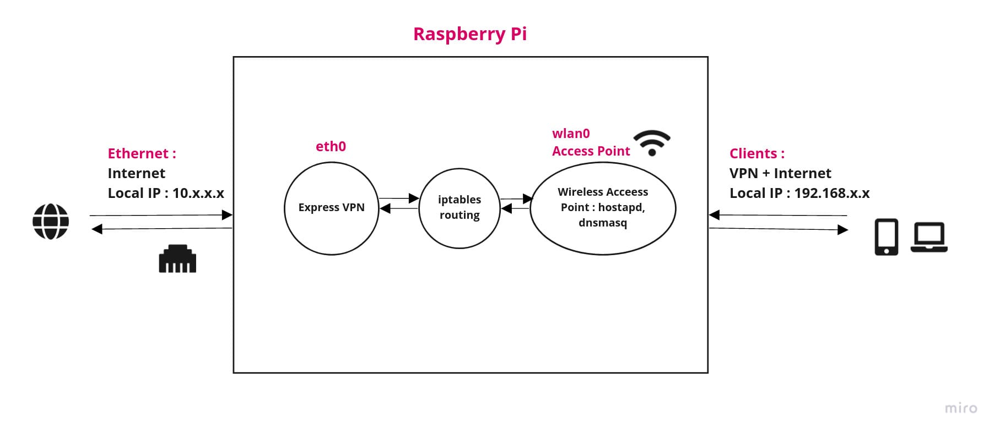

# Conclusion of this Project

- The speed of the Wifi from Raspberry Pi is being capped by the Wifi Adapter present in Raspberry Pi 4B.
- RPi 4B supports both 2.4 Ghz and 5Ghz but a band of both 20 Mhz and 40 Mhz. But the porblem is that it doesn't support channel numbers : `34`,`38`,`42`,`46`, etc. which are the `allowed channels to use 40/80 MHz in India`. That is why the speed is being capped at 54 Mb/s (Mb - Megabits) becuase we can use only 20MHz here. For complete list of allowed channels - [https://en.wikipedia.org/wiki/List_of_WLAN_channels](https://en.wikipedia.org/wiki/List_of_WLAN_channels).
- Still the speed should have been 100Mbps but it is capped mainly because the Wifi adapter shares the same bus as USB 2.0 ( according to some articles )
- Possible Solution : **Buy a USB 3.0 Wireless adapter which supports `AP (Access Point) Mode`, `802.11ac` and `40 MHz` at least.**

# Acheieved Goals:

- Wifi connection at LBS:<br/> 
 
ℹ️ This testing was done on Raspberry Pi 4 Model B Rev 1.1. The results may vary.

| Device | Before | After | After with Express Vpn |
| --- | --- | --- | --- |
| Android | 16 Mbps | 54 Mbps | Roughly Same: 50 Mbps |
| Laptop | 8 Mbps | 54 Mbps | Roughly Same: 50 Mbps |

- Able to run vpn on raspberry pi.
- Generally to connect 3 different devices with VPN we need 3 different account connections ( for express vpn, my key obtained for free through some resources ). This lead to exhaustion of key + the slow wifi made it unusable. But now multiple devices can connect to the Pi and use vpn with `just one account` registered with Pi and that too with *high* speed!

# Method:

The method is very trivial to understand, just the setup was a bit tough ( for me :D ) <br/>


# Tech Stack:

- hostapd : for AP creation
- dnsmasq : for DNS/DHCP configuration of clients
- expressvpn : best possible choice out there.

- Tutorial to set up AP in raspberry pi : [here](https://www.raspberrypi.com/documentation/computers/configuration.html#setting-up-a-routed-wireless-access-point)

# Configs:

## dhcpcd.conf

- Location : `/etc/dhcpcd.conf`

```console
interface wlan0			
    static ip_address=192.168.4.1/24
    nohook wpa_supplicant

```

## routed-ap.conf

- Location : `/etc/sysctl.d/routed-ap.conf`

```console
# Enable IPv4 routing
net.ipv4.ip_forward=1
```

## iptables config

- Command : `sudo iptables -t nat -A POSTROUTING -o eth0 -j MASQUERADE`
- Command 2 : `sudo iptables -t nat -A POSTROUTING -o tun0 -j MASQUERADE`
- `-o eth0` : the outgoing interface ( in this case LAN )
- `-o tun0` : required for VPN for tunnel interface forwarding


## dnsmasq config

- Location  : `/etc/dnsmasq.conf`

```console
interface=wlan0 # Listening interface
dhcp-range=192.168.4.2,192.168.4.20,255.255.255.0,24h
                # Pool of IP addresses served via DHCP
domain=wlan     # Local wireless DNS domain
dhcp-option=6, 10.165.0.1
address=/gw.wlan/192.168.4.1
                # Alias for this router

```

## hostapd config

- Location : `/etc/hostapd/hostapd.conf`

```console
country_code=IN
interface=wlan0
ssid=PiLan2

hw_mode=a
channel=36

macaddr_acl=0
auth_algs=1
ignore_broadcast_ssid=0
wpa=2
wpa_passphrase=SheharPi
wpa_key_mgmt=WPA-PSK
wpa_pairwise=TKIP
rsn_pairwise=CCMP

# N
ieee80211n=1

# AC
ieee80211ac=1

# Other
wmm_enabled=1 # QoS

```

## interfaces config

- Location : `/etc/network/interfaces`

```console
# replace wlan0 with your adapter to be used. check output of iwconfig.
auto wlan0
allow-hotplug wlan0
iface wlan0 inet dhcp
wpa-conf /etc/wpa_supplicant/wpa_supplicant.conf
wireless-power off              # turns power management off for the adapter
iface default inet dhcp
```

- This is used to turn of the power management mode of inbuilt wifi

# Know Issues and Bugs:

- Express vpn DNS bug - Causes internet to not work. Cant connect to websites, but can ping to IP addresses. Due to not updating of dns server on the file `/etc/resolv.conf` due to the option `force_vpn_dns=true`.

### Workaround :

1. Expressvpn after connecting saves dns address in file at `/etc/resolv.conf.bak` or similar ( can be verified by viewing the file, the address should be of form 10.x.x.x ).
2. Now replace the configs by executing `sudo mv /etc/resolv.conf.bak /etc/resolv.conf`. Here `resolv.conf.bak` is the name of file obtained above.
3. To let connected clients connect to internet on vpn edit the file `/etc/dnsmasq.conf` and edit the line 
```console
dhcp-option=6, <expressvpn dns server>
```
and replace the with the DNS server obtained in step 1. Reload the dns service using `sudo systemctl restart dnsmasq.service` and disconnect and reconnect the clients<br/>
